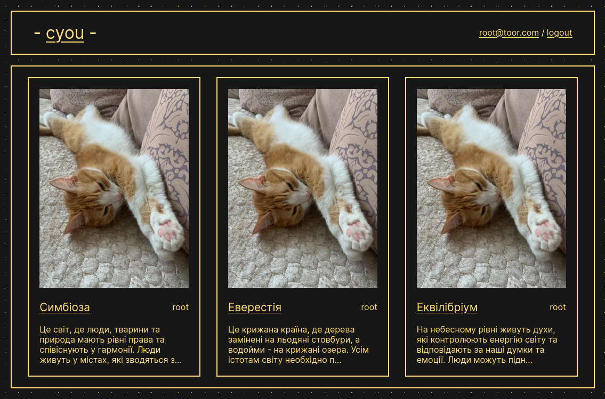

# cyou - *Create Your Own Universe*

> Welcome to our platform, where you can create and share your own imaginary universe with others! Our platform is designed to let you unleash your creativity and imagination, and build your own world from scratch. Whether you're a writer, artist, or simply a dreamer, you can bring your ideas to life here.

> On our platform, you can create your own creatures, plants, and even laws of physics. You can add drawings, stories, or any other content that will help bring your universe to life. Once you've built your universe, you can share it with other users, who can explore it, comment on it, and even add it to their favorites.

>With our platform, you can connect with other like-minded people and explore their universes too. You can discover new ideas, get inspiration, and give and receive feedback from other users. Our platform is a vibrant community of creators, where you can share your creativity with the world and get recognition for your work.

